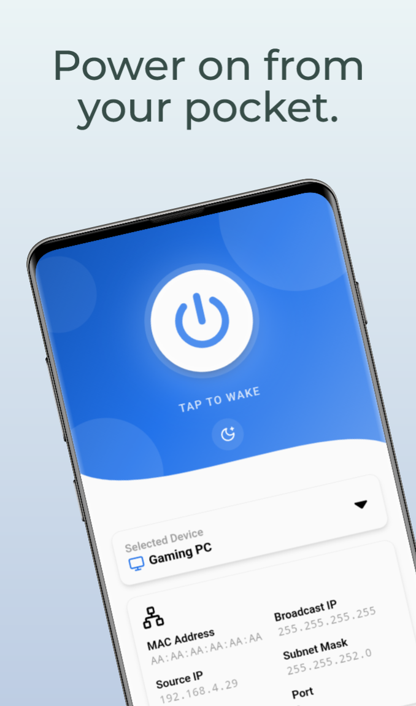
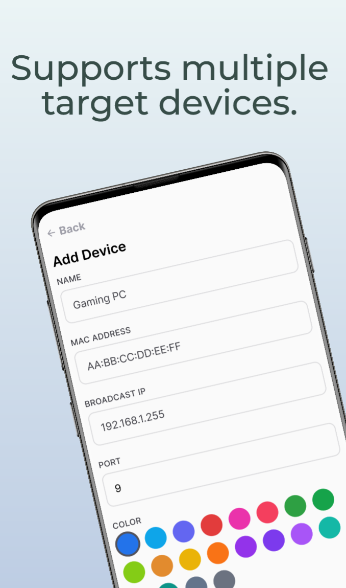
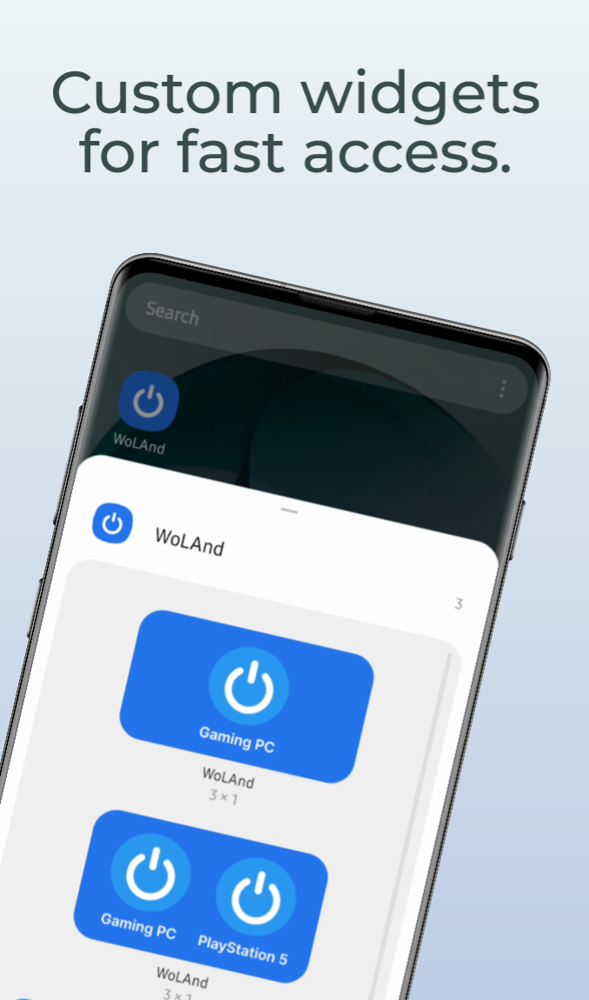
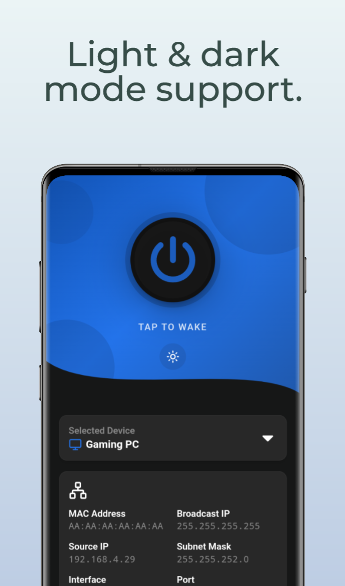

# WoLAnd (Wake on LAN Android)

A simple yet powerful Android app for remotely waking up your devices using Wake-on-LAN (WoL) technology.

Save and manage multiple devices, and instantly power on computers, consoles, servers, and many other devices from your phone — with convenient homescreen widgets for quick access.

<div align="center">
  <table>
      <tr>
          <td></td>
          <td></td>
          <td></td>
          <td></td>
      </tr>
  </table>
</div>

# Installation

Download the latest ready-to-install APK from the [releases page](https://github.com/zevnda/woland/releases)

# Build It Yourself

### Prerequisites

- **Node.js** (v18+) - [nodejs.org](https://nodejs.org)
- **Rust** - [rustup.rs](https://rustup.rs)
- **MSVC C++ build tools.** - [visualstudio.microsoft.com](https://visualstudio.microsoft.com/visual-cpp-build-tools/)
- **Android SDK** - [Android Studio](https://developer.android.com/studio) or [Android SDK command-line tools](https://developer.android.com/studio/command-line)

### 1. Clone Repo
```bash
git clone https://github.com/zevnda/woland.git
cd woland
```

### 2. Install Dependencies
```bash
pnpm install
```

### 3. Build APK

```bash
pnpm tauri android build --apk --target aarch64
```

Your APK needs to be self-signed in order to install it on your device, follow the links below for more information:
- [Developing a mobile application - Tauri](https://v2.tauri.app/develop/#developing-your-mobile-application)
- [Building an APK bundle - Tauri](https://v2.tauri.app/distribute/google-play/#build-apks)
- [APK code signing - Tauri](https://v2.tauri.app/distribute/sign/android/)

# Homescreen Widgets

WoLAnd includes three homescreen widgets for quickly waking up your devices. Depending on the widget size, you can control up to 4 devices from a single widget.

To choose which devices appear, reorder them in the device drawer by dragging them. If you change the order, remove and re-add the widget to apply the update.

# License
Copyright © 2026 zevnda — **[MIT License](./LICENSE)**